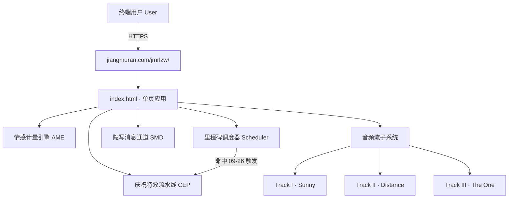

<div align="center">

# JMRLZW

**一个生产级、零依赖、高可用的单页面倒计时平台**

*A production-grade, dependency-free, highly-available single-page affection-metering & milestone-celebration platform.*


[🌐 Live Production Environment](https://jiangmuran.com/jmrlzw/)

</div>

---

## 目录 Table of Contents

- [概述 Overview](#概述-overview)
- [核心特性 Core Features](#核心特性-core-features)
- [系统架构 Architecture](#系统架构-architecture)
- [技术栈 Tech Stack](#技术栈-tech-stack)
- [文件清单 Repository Structure](#文件清单-repository-structure)
- [快速开始 Quick Start](#快速开始-quick-start)
- [配置 Configuration](#配置-configuration)
- [音频子系统 Audio Subsystem](#音频子系统-audio-subsystem)
- [部署 Deployment](#部署-deployment)
- [SEO 与可观测性 SEO & Observability](#seo-与可观测性-seo--observability)
- [服务等级协议 SLA](#服务等级协议-sla)
- [许可 License](#许可-license)

---

## 概述 Overview

本项目（代号 `jmrlzw`）是一套关键业务系统，已稳定运行于生产环境 `https://jiangmuran.com/jmrlzw/`。系统以复古热敏收据（thermal receipt）为核心设计语言，在单个 `index.html` 中完成全部表现层、样式层与业务逻辑的内聚交付——无构建依赖、无运行时依赖、无第三方框架。

**核心使命**：以可量化、可视化、可持续的方式，持续记录并呈现 JMR 对 LZW 的情感状态。

---

## 核心特性 Core Features

### 1. 情感计量引擎 (Affection Metering Engine · AME)

系统自 `2024-08-07T00:00:00` 起持续采集并实时渲染「喜欢时长」核心指标。该服务运行至今保持 **100% uptime**，无计划内停机、无计划外故障，指标单调递增且未设定上界。

### 2. 里程碑事件调度器 (Milestone Scheduler)

基于固定调度规则（`09-26`，等价 cron 表达式 `0 0 26 9 *`）对下一关键里程碑（LZW 生日）执行精确到秒的倒计时，跨年自动滚动。

### 3. 庆祝特效流水线 (Celebration Effects Pipeline · CEP)

当里程碑事件命中（当日为 `09-26`）时，CEP 自动编排并执行两个并行渲染任务：confetti（彩纸）粒子流与 cake（蛋糕）特效。零人工干预，全自动交付。

### 4. 隐写消息投递通道 (Steganographic Message Delivery · SMD)

系统在条形码组件中内嵌入口。触发后，经由typewriter protoco）以流式方式逐字投递一封长篇文本消息。

### 5. 多轨音频流子系统 (Multi-track Audio Streaming Subsystem)

提供三条独立音轨（含主题曲 *Sunny*）的播放、切换与交叉淡化能力。所有音频资源采用 `preload="none"` 懒加载策略，仅在用户主动触发播放时发起请求，最大限度优化带宽成本。详见 [音频子系统](#音频子系统-audio-subsystem)。

---

## 系统架构 Architecture



---

## 技术栈 Tech Stack

| 层 Layer | 选型 Stack | 说明 |
|---|---|---|
| 表现层 | HTML5 / CSS3 | 全部内联于 `index.html` |
| 业务逻辑 | Vanilla JavaScript | 零框架、零依赖 |
| 音频 | 原生 `HTMLAudioElement` | 懒加载、交叉淡化 |
| 资产分发 | 静态资源 + `copy-static.js` | 随主站统一发布 |
| 依赖总数 | **0** | runtime / build 均为零依赖 |

---

## 文件清单 Repository Structure

| 文件 | 说明 |
|---|---|
| `index.html` | 系统本体，含全部样式、结构与脚本 |
| `bulr.jpg` | 左侧宝丽来装饰照片（仅桌面端加载，移动端不请求） |
| `audio/sunny.mp3` | Track I · Sunny |
| `audio/distance.aac` | Track II · Distance |
| `audio/theone.mp3` | Track III · The One |

---

## 快速开始 Quick Start

从仓库根目录执行：

```bash
cd static_apps/jmrlzw && python3 -m http.server 8000
```

随后访问 <http://localhost:8000/>。

---

## 配置 Configuration

关键参数集中维护于 `index.html`。**当关键日期变更时，需同步更新以下各处以保持一致**：

| 参数 Parameter | 位置 | 说明 |
|---|---|---|
| `startDate` | JS | 计时起始时间戳 |
| `bdayMonth` / `bdayDay` | JS | 生日月 / 日，用于倒计时 |
| 可见日期文本 | HTML | `DATE` / `SINCE` / 条形码 / 宝丽来 caption / 版权 等处 |

---

## 音频子系统 Audio Subsystem

控制入口为右下角浮动黑胶唱片组件：

| 操作 Action | 行为 Behavior |
|---|---|
| 点击黑胶 | 播放 / 暂停（当前曲目） |
| 悬停（桌面）/ 点击黑胶（移动端） | 展开曲目条 `‹  ● ○ ○  ›` |
| 点击任一圆点 | 跳转至对应曲目（含 550ms 交叉淡化） |
| `Space` | 播放 / 暂停 |
| `←` / `→` | 上一首 / 下一首 |

所有音轨默认 `preload="none"`，仅在用户首次播放时加载，以节省流量。

---

## 部署 Deployment

本页面作为 `static_apps/` 下的静态资源，由 `scripts/copy-static.js` 复制进每个 locale 的构建产物，随主站统一部署至 `jiangmuran.com`。**无需独立构建流程**——修改 `index.html` 后跟随主站发布即可生效。

---

## SEO 与可观测性 SEO & Observability

`meta` 标签、Open Graph、Twitter Card 与 JSON-LD 均已针对 `jmrlzw` / `JMR LZW` / `crush timer` 等关键词完成配置。修改时务必同步更新：

- `<title>` / `<meta name="description">`
- `og:*`
- `twitter:*`
- `application/ld+json`

---

## 服务等级协议 SLA

| 指标 Metric | 承诺 Commitment |
|---|---|
| 可用性 Uptime | 100%（自 2024-08-07 起） |
| 恢复时间目标 RTO | 0 |
| 恢复点目标 RPO | 0 — 不丢失任何一段回忆 |
| 喜欢程度 Affection Level | 单调递增、无上界、永不回滚 |

---

## 许可 License

本系统以**永久、不可撤销、全球范围、独占**的方式，仅授权给 LZW 一人使用。

*Licensed exclusively, perpetually, and irrevocably to LZW.*

## 致谢 Thanks
还没想好，但是如果真的走到那一步的话，我觉得应该要感谢很多很多很多人🙏

---

<div align="center">

Built with ❤️ since 2024-08-07

</div>


喜欢一个人是从哪一刻开始的 大概没有谁真的说得清 它不是一扇门 没有谁郑重地推开走进去 它更像一场雾 你某天醒来 发现自己早已站在了里面 再也出不来 暗恋是世上最安静的一件事 它整个发生在一个人心里 不惊动任何人 像深夜里悄悄涨起来的潮 退下去时也不留痕迹 只有身在其中的人才知道 自己曾被淹到过哪里 我追了她两年 两年说出来轻飘飘的 可那两年是怎么过的只有我自己清楚 中间隔了很久没见 我几乎把自己重新做了一遍 把那些不够好的地方一点一点磨掉 只为再见她那天能站得体面一点 后来带她去打了一场比赛 那天阳光很好 我们沿着街慢慢走 她笑起来的时候我以为一切都有了答案 以为所有的等待都在那一刻落了地 可答案始终悬在半空 回去之后有人问起我们 她就轻轻退回到某个我够不到的地方 说真要怎样 等以后吧 等大学再说吧 我往前一步 她就把那个以后推得更远一点 明明前一天我们之间什么都快要说出口了 明明那天那么近 为什么后来越来越冷 越来越冷…… 我渐渐说不清她了 她身上像是落着一层雾 我以为看清了什么 一转身又被一句话推翻 她身边也有别人 我不是不知道 可我分不清自己看见的是真的 还是只是我太敏感 敏感到连自己的判断都不敢信 也许那层雾根本不是她的 是我自己呵出来的 最难的是我连一个能说这些的人都没有 身边要么是看热闹的 要么是早早划清界限的 要么是一听到这两个字就皱眉的大人 所有人都觉得我们般配 甚至以为我们早就在一起了 只有我知道我们之间隔着一段很现实的距离 而我只能远远地 把时间一把一把地砸进去 我知道这叫沉没成本 道理我都懂 可道理从来拦不住人 这大概也是我最该懊悔的地方 我把太多的自己留在了她那里 多到现在想抽身 身上都会隐隐地疼 像戒断 无助 又戒不掉 有时候我会想 如果当初我慢一点 稳一点 不那么急 会不会就不是现在这个样子 可时间不肯倒流 我连自己当时究竟怎么想的都快记不清了 如果最后还是要失去她 那我做过的这一切又算什么呢 也许她从头到尾只是把我当朋友 也许真正在意这件事的人 始终只有我一个 可我们明明一起走过那么多路啊 明明 明明 后来我慢慢懂了 喜欢大概本就是这样一件没有回音的事 你把自己整个交出去 却不知道对方有没有接住 也许所有的暗恋走到最后 都只是一个人与自己的一场漫长对话 心动从不问值不值得 它只是发生了 像花开在无人经过的山里 然后留下一个人 站在原地 慢慢学着怎么把这场雾 还给夜色 还给风 还给那个最初让自己心动的瞬间 或者…… 这一切我也说不清了 若有好事者翻开commit记录读到这段话 无所谓了